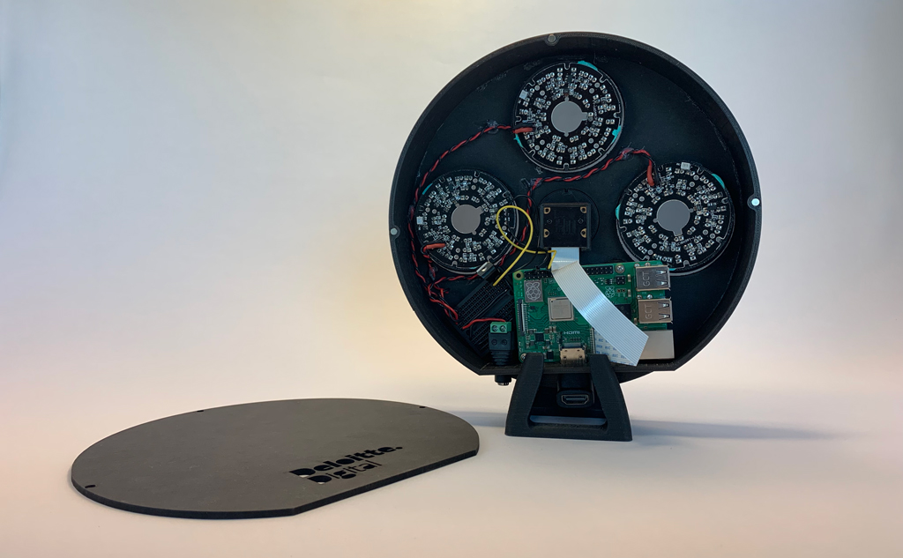

## VCDS - Vehicle Cleanliness Detection System

https://imagine.deloittedigital.no/project/vehicle-cleanliness-detection-system

### What
Autonomous cars have been a topic for quite some time and although they haven’t really had their breakthrough yet, big car manufacturers are battling to be the first to have a really autonomous car on the road. In light of the popular sharing economy, one of the models they’re aiming for is fleets of shared autonomous cars. So how will this service look like? An inevitable consequence of having such a fleet will be maintenance and cleaning.

The cars need to be looked after and when there’s no authority present, knowing when they need care is suddenly an unanswered question. Spending time checking all the cars for dirt and trash would be a time consuming task and a huge bottleneck, especially if the car is clean and could rather be in service. For this, we made the VCDS, Vehicle Cleanliness Detection System, that automatically captures the cleanliness state of a car and that will give the fleet operators a clue on which cars that need attention, and when they need it.

### How
We imagine this shared fleet as taxis driving around, picking up and dropping off people many times a day. The VCDS is a camera system that captures images of the car after each passenger has left it, and that then compares these images to reference images of the car in its clean state. By subtracting the two images from each other (image comparison), it’s able to see if there’s anything in the new image that wasn’t there from before, be it objects, dirt, spill or anything else. If the car’s ‘dirtiness’ is over a certain threshold, it could be instructed to drive to the closest cleaning facility. Well, what if someone just forgot something? Oh yes, we built object recognition into it as well, so if someone just left their bag, laptop etc., the VCDS identifies it as a forgotten object and immediately notifies the user to pick it up again.

### Impact
The VCDS is both an early stage concept and a proof of our capabilities as hardware makers and AI experimenters. It’s a fully functioning prototype for a fully plausible future, but it needs some wheels. Are you the car manufacturer or distributor for the future of autonomous mobility services? The VCDS offers autonomous maintenance for autonomous cars, which makes an available and high quality car fleet, and in turn happy customers. It’s on the shelf, waiting for its right owner!

### 1. Clone repo
...to a raspberry pi. If you want to run the code on a different platform, modifications are needed.

### 2. Install requirements
pip install -r requirements.txt

### 3. Get the VCDS prototype

### 4. Run main.py
python main.py

### 5. Watch the magic
